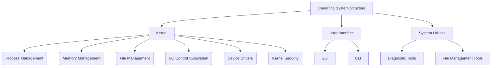

# Operating Systems (OS) - Comprehensive Notes

---

## 1. Introduction to Operating Systems

### What is an Operating System?
An **Operating System (OS)** is system software that manages computer hardware, software resources, and provides services for computer programs. It acts as an intermediary between users and hardware, enabling users to interact with computer systems through a consistent interface.

### Why Do We Need an Operating System?
An OS is critical for:
- **Resource Management**: Efficiently allocates resources (CPU, memory, storage) for optimal performance.
- **Abstraction of Complexity**: Simplifies hardware management for users, allowing applications to function without needing direct hardware control.
- **User Convenience**: Provides a cohesive environment for application execution and ensures secure, controlled system access.

Without an OS:
- Direct hardware interaction would be required, which is complex and prone to errors.
- Each application would need unique drivers for every device, leading to high compatibility issues.
- Multitasking, security, and efficient resource usage would be impossible.

### Goals of an OS
1. **Efficiency**: Ensure optimal use of hardware resources and system performance.
2. **Convenience**: Simplify interactions between the user and hardware.
3. **Security**: Protect against unauthorized access and system breaches.
4. **Reliability**: Maintain system stability and handle failures without crashing.
5. **Scalability**: Adapt to handle different scales of systems, from small devices to enterprise-level servers.

### Components of an OS
- **Kernel**: The core that manages system resources like memory, CPU, and devices.
- **File System**: Organizes and manages files on storage devices.
- **Device Drivers**: Translate commands for different hardware devices.
- **User Interface**: The graphical or command-line interface (CLI) through which users interact.
- **System Utilities**: Tools for diagnostics, performance management, and file handling.

### Boot Process
The **boot process** initializes the operating system when a computer is powered on:
1. **BIOS/UEFI Execution**: Firmware initializes hardware and hands control to the OS.
2. **Bootloader Activation**: Loads the kernel into memory (e.g., GRUB for Linux).
3. **Kernel Initialization**: Configures hardware, loads drivers, and starts essential system processes.

### OS Layers and System Architecture
- **Application Layer**: Where user applications and software interact with the OS.
- **Operating System Layer**: Manages core functions such as process, memory, and file systems.
- **Hardware Abstraction Layer (HAL)**: Acts as an interface between OS and hardware, ensuring compatibility across different devices.

---

## 2. Types of Operating Systems

### Characteristics of Different OS Types
| OS Type                     | Characteristics                                                                                                  |
|-----------------------------|------------------------------------------------------------------------------------------------------------------|
| **Batch Systems**           | Executes jobs in batches without user intervention. Common in mainframes and early systems (e.g., IBM systems). |
| **Multi-User OS**           | Allows multiple users to access the system simultaneously, with resource allocation to each user (e.g., UNIX).  |
| **Real-Time OS (RTOS)**     | Ensures time-bound processing for critical applications, common in embedded systems for industrial control.     |
| **Embedded OS**             | Designed for limited hardware resources; often used in appliances and IoT devices.                              |
| **Distributed OS**          | Manages a group of independent computers, giving users the illusion of a single coherent system.                |
| **Mobile OS**               | Designed for mobile devices, focusing on power efficiency and touch-based interaction (e.g., Android, iOS).     |
| **Network OS**              | Provides functionality for networking, file sharing, and security (e.g., Novell NetWare, Windows Server).       |
| **Cloud OS**                | Optimized for cloud-based environments, allowing resource scalability (e.g., OpenStack, Cloud Foundry).          |
| **Virtualization-Based OS** | Supports virtual machines to allow multiple OS instances on a single physical machine (e.g., VMware, Hyper-V).   |
| **Application-Specific OS** | Tailored for specific use cases, such as automotive OS (for cars) or IoT OS, optimized for specific applications.|

---

## 3. History of Operating Systems

### Timeline of OS Evolution
- **1950s-1960s**: **Batch Systems** for mainframe computers, with basic job scheduling.
- **1970s**: **UNIX** development introduced a modular, portable OS with a file-based system and multitasking.
- **1980s**: **DOS** and initial versions of **Windows** emerged for personal computers, bringing user-friendly interfaces.
- **1990s**: **Linux** gained popularity as an open-source OS, and graphical user interfaces became standard.
- **2000s**: Rapid growth of **mobile OS** (Android, iOS) and **cloud OS** for web-based applications.
- **Present Day**: Advanced OS models for **virtualization** (VMware, KVM), **containerization** (Docker, Kubernetes), and **IoT**.

### Significant Innovations in OS
- **Graphical User Interfaces (GUI)**: Popularized by macOS and Windows, revolutionized user interaction with computers.
- **Open-Source OS (Linux)**: Fostered collaborative development, leading to widespread OS customization.
- **Cloud OS**: Enabled remote scalability and computing-as-a-service models.
- **Virtualization**: Allowed multiple OS instances on a single hardware, facilitating cloud and data center applications.

---

## 4. OS Architecture and Design

### Kernel Structures

#### Monolithic Kernel
- **Design**: All OS services (e.g., file, memory, process management) run in kernel space.
- **Advantages**: High performance and low inter-process communication (IPC) overhead.
- **Disadvantages**: Vulnerable to bugs or crashes due to lack of modularity.

#### Microkernel
- **Design**: Only essential services run in kernel mode, with others in user mode.
- **Advantages**: Improved security and reliability due to isolation of services.
- **Disadvantages**: Higher IPC overhead, potentially affecting performance.

#### Hybrid Kernel
- **Design**: Combines elements of both monolithic and microkernel for balance.
- **Example**: macOS kernel (XNU) integrates both monolithic and microkernel principles.

#### Exokernel
- **Design**: Minimally involved kernel focused on resource protection rather than management.
- **Advantages**: Allows applications more direct control over hardware, boosting efficiency for specialized uses.

### Kernel Modularity and Extensibility
- Modular designs enable the addition and removal of kernel components without affecting the core kernel functionality, fostering adaptability and extensibility.

---

## 5. Kernel Components

### Core Kernel Components
1. **Process Management**: Controls process creation, scheduling, and termination.
2. **Memory Management**: Manages allocation of memory, virtual memory, and memory protection.
3. **File Management**: Provides organized storage, retrieval, and file permissions.
4. **I/O Control Subsystems**: Manages device I/O to ensure efficient data transfer.
5. **Device Drivers**: Interface directly with hardware devices for smooth operation.
6. **Kernel Security Modules**: Enforces security policies and system integrity checks.
7. **Inter-Process Communication (IPC)**: Manages data sharing and communication between processes.

### OS Security
- **Authentication**: Verifies user identity before granting access.
- **Authorization**: Defines permissions and access levels for users and processes.
- **Encryption**: Protects data integrity and confidentiality during communication and storage.
- **Intrusion Detection**: Identifies and mitigates unauthorized access attempts.

---

## 6. System Calls and APIs

### System Calls
- **Definition**: System calls provide an interface for applications to request OS services.
- **Types of System Calls**:
  - **Process Control**: Create, terminate, and manage processes.
  - **File Management**: Handle files (open, read, write, close).
  - **Device Management**: Control hardware devices.
  - **Information Maintenance**: Retrieve or set system-related information.
  - **Communication**: Enable data exchange between processes.

### Application Programming Interfaces (APIs)
- **Role**: APIs allow applications to interact with the OS without direct system calls.
- **User Mode vs. Kernel Mode**: Ensures security by switching between user (application) and kernel (system) modes.
- **System Call Overhead**: Refers to the performance impact of frequent switching between modes, mitigated by optimized syscall handling.

---

## 7. Virtualization and Cloud OS

### Role of Virtualization in OS
Virtualization allows multiple operating systems to run on a single physical machine:
- **Hypervisors**: Software (e.g., VMware, Hyper-V) that manages virtual machines (VMs).
- **Containerization**: Virtualizes only the application and its dependencies (e.g., Docker).
- **Advantages**: Efficient resource utilization, scalability, and isolation for secure multi-tenant environments.

### Cloud OS
A **Cloud OS** is tailored to manage and orchestrate cloud resources:
- Examples include OpenStack, which manages distributed resources like virtual machines, storage, and networking.
- Designed for scalability, supporting on-demand resource allocation.

---

## Summary Diagram of OS Components and Structure



---

# Overview of Different Operating Systems

---

## 1. Windows Operating System

1. **Kernel Architecture**
   - **Hybrid Kernel**: Combines elements of microkernel and monolithic kernel, improving flexibility.
   - **Components**:
     - **Executive**: Manages key system services (e.g., memory, I/O).
     - **Kernel**: Handles low-level tasks (e.g., context switching).
     - **HAL (Hardware Abstraction Layer)**: Provides hardware compatibility across devices.

2. **Memory Management**
   - **Virtual Memory Manager (VMM)**: Uses paging for efficient memory allocation.
   - **ASLR (Address Space Layout Randomization)**: Adds security by randomizing memory addresses.

3. **File Systems**
   - **NTFS**: Supports large files, encryption, and journaling.
   - **ReFS**: Resilient system for high data integrity, used in large datasets.

4. **Process Scheduling**
   - **Preemptive Multitasking**: High-priority tasks get more CPU time.
   - **Windows Scheduler**: Uses time slices, with priority-based scheduling.

5. **Security Model**
   - **User Account Control (UAC)**: Limits application privileges.
   - **BitLocker**: Encrypts disks for data protection.

---

## 2. macOS (Based on Darwin OS)

1. **Kernel Architecture**
   - **XNU Kernel**: Hybrid kernel combining Mach microkernel and BSD monolithic components.
   - **Mach Layer**: Manages tasks and memory.
   - **BSD Layer**: Provides UNIX features and POSIX compliance.

2. **Memory Management**
   - **Virtual Memory**: Demand paging and unified buffer cache for efficiency.
   - **Shared Memory**: Used to enhance process communication.

3. **File Systems**
   - **APFS**: Optimized for SSDs, supports snapshots, cloning, and encryption.
   - **HFS+**: Legacy file system for compatibility.

4. **Process Scheduling**
   - **Priority-Based Scheduling**: Uses dynamic thread priority.
   - **Grand Central Dispatch (GCD)**: Manages concurrent tasks with dispatch queues.

5. **Security Model**
   - **System Integrity Protection (SIP)**: Protects system files.
   - **Keychain**: Stores sensitive data securely.
   - **Sandboxing**: Isolates applications for better security.

---

## 3. Linux (e.g., Ubuntu, Fedora, Debian)

1. **Kernel Architecture**
   - **Monolithic Kernel**: Core services integrated into the kernel.
   - **Loadable Kernel Modules (LKMs)**: Allow dynamic loading/unloading for flexibility.

2. **Memory Management**
   - **Demand Paging**: Loads program sections as needed.
   - **Transparent Huge Pages (THP)**: Optimizes memory by using large pages.

3. **File Systems**
   - **ext4**: Default, supports journaling and large files.
   - **Btrfs**: Provides snapshots and data integrity features.
   - **XFS**: High-performance for parallel I/O.

4. **Process Scheduling**
   - **Completely Fair Scheduler (CFS)**: Maintains fair CPU time distribution.
   - **Real-Time Scheduling**: Supports strict timing for critical tasks.

5. **Security Model**
   - **Mandatory Access Control (MAC)**: Enforced with SELinux or AppArmor.
   - **Capabilities**: Fine-grained privilege control for processes.

---

## 4. Android OS (Linux-Based)

1. **Kernel Architecture**
   - **Modified Linux Kernel**: Optimized for mobile devices with specific drivers.
   - **Binder IPC**: Efficient communication between apps for security.

2. **Memory Management**
   - **Low Memory Killer**: Terminates background apps under low memory.
   - **Zygote Process**: Preloads resources for faster app start-up.

3. **File Systems**
   - **ext4**: Used for internal storage.
   - **F2FS**: Optimized for flash storage in some devices.

4. **Process Scheduling**
   - **Priority-Based Scheduling**: Real-time priority for critical processes.
   - **CFS**: Inherited from Linux for general scheduling.

5. **Security Model**
   - **Sandboxing**: Each app operates in a separate sandbox.
   - **SELinux**: Enforces access controls for apps and services.
   - **Permissions**: Apps request specific system permissions.

---

## 5. iOS (Based on Darwin OS)

1. **Kernel Architecture**
   - **XNU Kernel**: Similar to macOS, with additional mobile optimizations.
   - **Kernel Extensions (kexts)**: Dynamically loadable modules for device drivers.

2. **Memory Management**
   - **Automatic Reference Counting (ARC)**: Manages memory efficiently.
   - **Shared Memory**: Used for multimedia communication between apps.

3. **File Systems**
   - **APFS**: Supports encryption, snapshots, and efficient storage.
   - **Data Partitioning**: Separates user and system data for security.

4. **Process Scheduling**
   - **Preemptive Multitasking**: Provides real-time priority for critical tasks.
   - **Real-Time Scheduling**: Ensures smooth UI and audio playback.

5. **Security Model**
   - **Secure Boot Chain**: Verifies system integrity on boot.
   - **App Sandboxing**: Strict app isolation and communication limits.
   - **Data Protection**: File-level encryption tied to the user’s passcode.

---

## 6. Comparison of Key Technical Features

| **Feature**             | **Windows**                   | **macOS**                    | **Linux**                    | **Android**                  | **iOS**                        |
|-------------------------|-------------------------------|------------------------------|------------------------------|------------------------------|--------------------------------|
| **Kernel**              | Hybrid                        | XNU (Mach + BSD)             | Monolithic                   | Modified Linux               | XNU (Mach + BSD)               |
| **File System**         | NTFS, ReFS                    | APFS, HFS+                   | ext4, Btrfs, XFS             | ext4, F2FS                   | APFS                           |
| **Scheduling**          | Priority, quantum-based       | Priority, GCD                | CFS                          | CFS, real-time               | Real-time, preemptive          |
| **Memory Management**   | Paging, ASLR, VMM            | Virtual memory, shared       | Paging, THP, swapping        | Low memory killer, Zygote    | ARC, shared memory             |
| **Security**            | UAC, BitLocker               | SIP, Keychain                | SELinux, MAC                 | SELinux, sandboxing, perms   | Secure boot, sandboxing, data  |

--- 

# Key Reasons Why Applications Are OS-Specific

---

## 1. System Calls are OS-Specific

- **What are System Calls?**  
  System calls are special functions that allow an application to request services from the operating system (OS) kernel, which is the core part of the OS. System calls let applications do things like:
  - Open or create files.
  - Allocate memory.
  - Access hardware like printers or network devices.

- **Why are System Calls Different for Each OS?**  
  Every OS manages resources (memory, processors, storage) in its unique way. Because of this, the functions that an application calls to get these services vary from one OS to another. For example:
  - Linux, Windows, and macOS have different system calls for opening files, so a program compiled to use Linux’s system calls won’t work on Windows or macOS.

- **Example:**  
  If an application requests to open a file using Linux’s `open()` system call, it won’t be understood by Windows or macOS, which use different commands. This is why applications often need to be rewritten or adjusted to work on a new OS.

---

## 2. Binary Formats are OS-Specific

- **What is a Binary Format?**  
  A binary format is the structure of an application after it’s compiled (converted) from human-readable source code into machine code. This format organizes the instructions and data in a way that the OS can read and execute.

- **Why are Binary Formats Different for Each OS?**  
  Each OS has a specific binary format for applications to follow:
  - **Windows** uses **PE (Portable Executable)** format.
  - **Linux** uses **ELF (Executable and Linkable Format)**.
  - **macOS** uses **Mach-O** format.
  These formats are incompatible, so an application compiled in Linux’s ELF format won’t be recognized or executed by Windows, which uses PE format.

- **Example:**  
  If you try running a Linux program with an ELF binary on a Windows OS, Windows will not recognize the format and refuse to execute the program.

---

## 3. CPU Instruction Sets Differ by Architecture

- **What is a CPU Instruction Set?**  
  A CPU instruction set is a set of commands a CPU (central processing unit) can execute. These commands are in machine code, the most basic language understood by computers. Common CPU architectures include:
  - **x86** (Intel or AMD, common in PCs).
  - **ARM** (common in smartphones and tablets).
  - **PowerPC** (found in older Mac computers and some game consoles).

- **Why This Matters for Applications**  
  Applications are compiled into machine code that matches a specific CPU’s instruction set. If an application was compiled for one instruction set, it can’t be directly executed by another. For example:
  - An app compiled for an Intel x86 CPU won’t work on an ARM-based phone unless it’s specifically recompiled or uses emulation.

- **Example:**  
  Many mobile apps are compiled for ARM CPUs used in smartphones. Trying to run one of these apps on an x86-based PC will fail unless the app is specially adapted for that CPU.

---

## 4. System Libraries and APIs are OS-Specific

- **What are System Libraries and APIs?**  
  System libraries are collections of functions that allow applications to perform common tasks like graphics rendering, file handling, or network communication without needing to write all the code from scratch. APIs (Application Programming Interfaces) are standards that applications use to communicate with the OS.

- **Why are Libraries and APIs Different Across OSes?**  
  Each OS has its own set of libraries and APIs designed to work with its unique structure:
  - macOS applications often use the **Cocoa** library for graphics, while Linux applications might use **GTK** or **Qt**.
  - Similarly, Windows uses **DirectX** for gaming and graphics, while Linux prefers **OpenGL** or **Vulkan**.
  These differences mean that an application built with macOS libraries won’t work on Linux or Windows without major changes.

- **Example:**  
  A video game developed using DirectX (Windows-specific) won’t run on Linux because Linux doesn’t support DirectX. Instead, Linux uses OpenGL or Vulkan, so the game needs to be reprogrammed to use these alternatives to work on Linux.

---

## 5. Differences in System Call and API Implementations

- **Implementation Differences**  
  Even when different OSes support similar functions (like creating files or opening network connections), the details of these functions may vary in:
  - **Function Names and Parameters**: For example, to open a file, Linux uses the `open()` system call, whereas Windows uses `CreateFile()`.
  - **Error Handling**: Different OSes handle errors in unique ways, so applications need to adjust error handling for each OS to avoid unexpected behavior.

- **Example**  
  If a program is written to work on Linux, it may use Linux’s `open()` call, expecting certain types of responses and error codes. If run on Windows, which uses `CreateFile()` and has different error codes, the program may not function correctly or handle errors as expected.

---

## Solutions for Cross-Platform Applications

Cross-platform applications aim to work across multiple OSes without extensive rewrites. Here are common solutions developers use to make applications work across OSes:

### 1. Interpreted Languages (e.g., Python, Ruby)

   - **How It Works**: Instead of compiling the program into machine-specific binaries, interpreted languages are run via an interpreter installed on each OS, which translates code to machine code at runtime.
   - **Advantages**: The same code can run on multiple OSes as long as the interpreter is available (e.g., Python code can run on both Windows and Linux if Python is installed).
   - **Disadvantages**: Interpreted languages tend to run slower since code is translated in real-time.

### 2. Virtual Machines (e.g., Java)

   - **How It Works**: Some languages compile code into an intermediate form called bytecode, which is not specific to any OS or CPU. This bytecode runs inside a **virtual machine** (e.g., the Java Virtual Machine), which abstracts the underlying OS.
   - **Advantages**: Java applications can run on any OS that has a JVM, allowing broad compatibility.
   - **Disadvantages**: Applications running on virtual machines can perform slower than those compiled for a specific OS.

### 3. Cross-Platform Development Tools (e.g., POSIX, Electron)

   - **POSIX**: POSIX is a standard that helps make applications compatible across UNIX-like systems. Using POSIX-compliant APIs enables programs to run on various UNIX-based OSes (e.g., Linux, macOS) with few changes.
   - **Electron**: Electron is a framework that allows developers to create desktop applications using web technologies (HTML, CSS, JavaScript). The same application can then run on Windows, macOS, and Linux.

   - **Advantages**: Cross-platform tools reduce the amount of OS-specific code developers need to write.
   - **Disadvantages**: These tools may still require some OS-specific tweaks, and applications might not perform as well as native apps optimized for a single OS.

---

## Why Cross-Platform Development Remains Challenging

Creating truly cross-platform applications remains difficult because of several factors:
- **Continuous OS Evolution**: New system calls, libraries, and APIs are added with OS updates, which may introduce compatibility issues.
- **Different Hardware Architectures**: Applications optimized for one type of CPU or device (e.g., ARM for mobile, x86 for PC) may not run as efficiently on another.
- **Performance Trade-Offs**: Cross-platform solutions like interpreters and virtual machines are often slower than native applications, which are compiled for a specific OS and hardware.

---

# Linkers, Loaders, and Related Concepts

---

## 1. Introduction to Linkers and Loaders

In the software development process, the code written by developers goes through several stages before it’s executed by the operating system. These stages involve compiling, linking, and loading. Key components in this process are:
- **Linkers**: Combine multiple code modules into a single executable.
- **Loaders**: Load the executable into memory so it can run.

---

## 2. Compilation Process Overview

To understand linkers and loaders, it helps to first understand the stages a program goes through before it executes:

1. **Source Code**: The human-readable code written in a programming language (like C or Java).
2. **Compilation**: Converts source code into object code (machine code).
3. **Linking**: Combines object code files and resolves references between them to create an executable.
4. **Loading**: Loads the executable into memory, setting it up to run.

---

## 3. Linkers

### What is a Linker?
A **linker** is a program that combines multiple object files (machine code files) into a single executable file. During the compilation, each module (or source file) is compiled separately into an object file. The linker takes these separate object files and “links” them together, resolving any cross-references between them.

### Functions of a Linker
1. **Symbol Resolution**: Determines where each variable and function is defined across different object files and resolves these addresses.
2. **Address Binding**: Assigns specific memory addresses to variables and functions in the final executable.
3. **Library Linking**: Links external libraries (like the standard C library) to the program so it can use common functions like `printf` or `scanf`.

### Types of Linking
- **Static Linking**:
  - The linker copies all necessary libraries and code modules directly into the final executable.
  - Increases the file size but ensures the program has everything it needs to run independently.
  - Common in embedded systems or cases where dependencies should not change.

- **Dynamic Linking**:
  - The linker leaves references to shared libraries, which are loaded into memory at runtime.
  - Reduces file size, as the code in libraries is shared by multiple programs.
  - Common in operating systems like Windows and Linux, where applications share system libraries.

### Example of Linking
When a C program calls `printf()`, the compiler doesn’t know where `printf` is defined. The linker identifies where `printf` is located in the standard C library and links it to the program.

---

## 4. Loaders

### What is a Loader?
A **loader** is part of the OS that loads an executable program into memory, preparing it to run. When a user launches an application, the loader is responsible for:
- **Loading the program’s code** into memory.
- **Setting up the runtime environment** (allocating memory, setting up stack and heap).
- **Starting the program execution** by passing control to the program’s entry point (e.g., the `main` function).

### Functions of a Loader
1. **Memory Allocation**: Allocates memory for the code, data, stack, and heap sections of the program.
2. **Relocation**: Adjusts memory addresses in the code to match the actual memory layout where the program is loaded.
3. **Dynamic Linking** (if applicable): Loads and links shared libraries that are dynamically linked.
4. **Initialization and Execution**: Passes control to the program’s entry point so it can start executing.

### Types of Loaders
- **Absolute Loader**:
  - Loads the program at a specific memory address defined at compile-time.
  - Simple but inflexible, as the program must always load at the same address.

- **Relocating Loader**:
  - Adjusts addresses within the program code based on where it’s loaded in memory.
  - Common in modern systems, as it allows programs to run anywhere in memory.

- **Dynamic Loader**:
  - Loads dynamic libraries during runtime as needed by the program.
  - Reduces memory use since multiple programs can share the same library in memory.

---

## 5. Linking and Loading in the Program Lifecycle

### 1. **Compile-Time**:  
   - The source code is translated into object code files, but references to external functions or libraries remain unresolved.

### 2. **Link-Time**:  
   - The linker combines object files, resolves external references, and produces a single executable file.
   - In static linking, libraries are included in the executable, whereas dynamic linking only keeps references to shared libraries.

### 3. **Load-Time**:  
   - The loader loads the executable into memory.
   - For dynamically linked programs, the loader also loads the necessary shared libraries into memory.
   - The loader initializes the program’s environment and starts the execution.

---

## 6. Related Concepts

### Relocation
- **Definition**: The process of adjusting memory addresses in the program’s code and data sections to match the actual memory layout where it’s loaded.
- **Example**: If a program is compiled to run from memory address `1000` but loaded at address `2000`, the loader will adjust addresses within the program.

### Symbol Table
- **Definition**: A data structure used by the linker and loader to track addresses and symbols (variables, functions) across multiple object files.
- **Purpose**: Helps the linker resolve references between modules and enables the loader to bind addresses during loading.

### Shared Libraries
- **Definition**: Libraries that multiple programs can use simultaneously, reducing memory usage.
- **Examples**:
  - **DLL (Dynamic Link Library)** files in Windows.
  - **SO (Shared Object)** files in Linux.
- **How They Work**: Shared libraries are loaded only once in memory and shared across programs that need them, enabling more efficient memory use and smaller application files.

### Dynamic Linking vs. Static Linking
- **Dynamic Linking**:
  - Libraries are loaded at runtime.
  - Reduces executable size.
  - Enables library updates without recompiling dependent programs.
- **Static Linking**:
  - Libraries are included in the final executable at link-time.
  - Increases file size but ensures the program is self-contained.

### Lazy Loading
- **Definition**: A technique where dynamic libraries are only loaded when they are actually needed by the program.
- **Benefit**: Reduces memory usage and speeds up application start time.
- **Example**: If a program only uses a specific library function at certain times, lazy loading delays loading the library until the function is actually called.

---

## 7. Summary Table: Linkers vs. Loaders

| Feature            | Linker                                             | Loader                                                |
|--------------------|----------------------------------------------------|-------------------------------------------------------|
| **Purpose**        | Combines object files into a single executable     | Loads the executable into memory and starts execution |
| **When It Runs**   | After compilation, before execution                | At the time of execution (when the program is launched) |
| **Types**          | Static linker, dynamic linker                      | Absolute loader, relocating loader, dynamic loader    |
| **Key Functions**  | Symbol resolution, address binding, library linking | Memory allocation, relocation, dynamic linking       |
| **Example Usage**  | Linking `printf` from standard library in C        | Loading an application and its libraries at runtime   |

---

## 8. Real-World Example: Linking and Loading in C Programs

When a C program is compiled, it typically undergoes the following stages:

1. **Compilation**: Each source code file (`.c`) is compiled into an object file (`.o`).
2. **Linking**: The linker combines all `.o` files, resolves external references, and produces a single executable (e.g., `a.out` on Linux).
3. **Loading**: When the executable is run, the loader loads it into memory, links any required shared libraries (like the C standard library), and then begins execution.

If the program uses a function like `printf`, the linker will link it to the C library where `printf` is defined, and the loader will load that library if it’s dynamically linked.

---

## 9. Key Takeaways

- **Linkers** are responsible for combining code modules and preparing an executable, resolving symbols, and linking libraries.
- **Loaders** load the program into memory, setting up the environment and adjusting addresses as needed.
- **Static vs. Dynamic Linking** affects how libraries are included, with dynamic linking offering smaller executables and easier library updates.
- **Relocation and Symbol Tables** help manage memory and reference resolution during loading.


# Comprehensive Notes on Binary Numbers, Data Representation, Computer Architecture, and Compilers & Interpreters

---

## 1. Binary Numbers and Data Representation

Binary numbers, data encoding, and data representation are foundational concepts in computer science. This section dives into these topics, covering how data is represented, stored, and interpreted by computers.

---

### Binary System

1. **Binary Basics**:
   - Computers use **binary** (base-2) to represent data with two symbols: **0** and **1**.
   - Each binary digit (bit) represents an "ON" (1) or "OFF" (0) state in electronic circuits.
   - In computing, **8 bits = 1 byte**, and each byte can represent 256 values (from 0 to 255).

2. **Binary Counting**:
   - Counting in binary is similar to decimal but uses powers of 2.
   - Example:
     - **Binary 1010** represents 10 in decimal.
     - **Binary 1111** represents 15 in decimal.

3. **Practical Example**:
   - Converting decimal numbers to binary: 
     - To convert 23 to binary, divide by 2 repeatedly: 23 → 10111.
   - Converting binary numbers to decimal:
     - Binary `1101` to decimal: 1×2³ + 1×2² + 0×2¹ + 1×2⁰ = 13.

---

### Data Encoding

Data encoding maps binary values to characters, enabling text storage, display, and processing.

1. **ASCII**:
   - **ASCII** (American Standard Code for Information Interchange) uses **7 bits** to represent 128 characters.
   - Example: `01000001` in binary is the ASCII encoding for "A".

2. **Unicode**:
   - **Unicode** extends ASCII, enabling representation of characters from different languages.
   - **UTF-8**: A common encoding format in Unicode, using 1-4 bytes per character.
   - Example: The character "A" in UTF-8 is `01000001`, while characters like "é" use multiple bytes.

3. **Practical Example - Encoding Text to Binary**:
   - Text like "Hello" is converted to binary using ASCII:
     - "H" = `01001000`, "e" = `01100101`, etc.

---

### Number Systems and Conversion

1. **Binary (Base-2)**:
   - Uses 0 and 1.
   - Binary 101 represents 5 in decimal.

2. **Decimal (Base-10)**:
   - Uses digits 0-9.
   - Each position represents a power of 10.

3. **Hexadecimal (Base-16)**:
   - Uses digits 0-9 and letters A-F.
   - Often used for memory addresses.
   - Example: Hex `1A3` is `419` in decimal.

4. **Octal (Base-8)**:
   - Uses digits 0-7.
   - Example: Octal `23` is `19` in decimal.

5. **Conversion Techniques**:
   - **Binary to Hexadecimal**: Group bits into sets of four.
   - **Decimal to Binary**: Divide by 2 repeatedly, recording remainders.

---

## 2. Computer Architecture

Computer architecture encompasses the design and organization of a computer’s core components, including the CPU, memory, storage, and I/O devices. Here, we explore the roles of each component.

---

### Central Processing Unit (CPU)

1. **CPU Overview**:
   - The CPU, or "brain" of the computer, executes instructions and performs calculations.
   - Key components include the **Arithmetic Logic Unit (ALU)**, **Control Unit (CU)**, and **Registers**.

2. **ALU (Arithmetic Logic Unit)**:
   - Performs arithmetic and logical operations (e.g., addition, subtraction, comparisons).
   - Example: The ALU processes instructions like `ADD R1, R2` to add values in registers R1 and R2.

3. **Control Unit (CU)**:
   - Directs data flow between the CPU, memory, and I/O devices.
   - Decodes instructions and tells other parts of the CPU what to do.

4. **Registers**:
   - Small, high-speed storage locations in the CPU.
   - Hold data, instructions, and addresses needed by the CPU during processing.

5. **CPU Execution Cycle (Fetch-Decode-Execute)**:
   - **Fetch**: Retrieves the next instruction from memory.
   - **Decode**: Interprets the instruction.
   - **Execute**: Carries out the instruction using the ALU if necessary.

---

### Memory (RAM and Cache)

1. **RAM (Random Access Memory)**:
   - Stores data and instructions currently in use.
   - Volatile memory: data is lost when the computer is turned off.
   - Example: Running a program loads it into RAM, allowing the CPU quick access to execute instructions.

2. **Cache**:
   - Faster, smaller memory located close to the CPU.
   - Holds frequently accessed data to reduce access time.
   - Example: Cache stores values that are repeatedly used, like counters or loop variables, improving speed.

---

### Storage

1. **Hard Disk Drive (HDD)**:
   - Uses magnetic storage to store data permanently.
   - Example: Data files, operating system files, and programs are stored here.

2. **Solid-State Drive (SSD)**:
   - Uses flash memory (no moving parts), making it faster and more reliable than HDDs.
   - Often used for boot drives and frequently accessed data.

---

### Motherboard and Buses

1. **Motherboard**:
   - The main circuit board connecting the CPU, memory, storage, and peripherals.

2. **Buses**:
   - **Data Bus**: Transfers data between CPU, memory, and I/O.
   - **Address Bus**: Carries addresses from CPU to memory, telling it where to read/write.
   - **Control Bus**: Sends control signals (e.g., read/write) to coordinate activities.

---

### Input and Output (I/O) Devices

1. **Input Devices**:
   - Devices like **keyboard**, **mouse**, and **scanner** send data to the computer.
   - Example: A keyboard translates keypresses into ASCII values sent to the CPU.

2. **Output Devices**:
   - Devices like **monitor**, **printer**, and **speakers** receive data from the computer.
   - Example: A monitor displays data processed by the CPU, translating binary data to pixels on the screen.

---

## 3. Compilers and Interpreters

Compilers and interpreters are essential tools that convert human-readable code (source code) into machine code that a CPU can execute.

---

### Compiler Stages

1. **Lexical Analysis**:
   - Breaks down code into **tokens** (keywords, variables, operators).
   - Example: The code `int a = 5;` is broken down into tokens like `int`, `a`, `=`, `5`, `;`.

2. **Parsing**:
   - Analyzes the structure (syntax) of code and builds a **syntax tree**.
   - Example: The syntax tree for `a = b + c;` has `=` as the root node with `a` on the left and `b + c` on the right.

3. **Code Generation**:
   - Converts the syntax tree into machine code.
   - Example: `a = b + c;` might generate machine instructions to load `b` and `c` into registers, add them, and store the result in `a`.

4. **Optimization**:
   - Refines the machine code for performance (e.g., reducing memory use, improving execution speed).
   - Example: Loop unrolling, where small loops are “unrolled” to reduce loop overhead.

---

### Interpreter

1. **How an Interpreter Works**:
   - Reads and executes code line-by-line, without producing an intermediate file.
   - Example: In Python, when you run `print("Hello, World!")`, the interpreter reads and executes that line immediately.

2. **Advantages**:
   - Easier to debug, as you see immediate results of each line.
   - More flexible for dynamic languages like Python.

3. **Disadvantages**:
   - Slower, since it interprets code line-by-line instead of running precompiled code.

---

### Compiler vs. Interpreter

| Feature              | Compiler                        | Interpreter                  |
|----------------------|---------------------------------|------------------------------|
| **Execution**        | Translates code into an executable | Executes code line-by-line   |
| **Speed**            | Fast at runtime                | Slower at runtime            |
| **Error Detection**  | Detects errors before execution| Detects errors during execution |
| **Example Languages**| C, C++                         | Python, JavaScript           |

---

## Practical Examples and Implementations

### Example 1: Converting Text to Binary
1. Using ASCII encoding:
   - Text: `Hello`
   - ASCII: `H = 01001000`, `e = 01100101`, etc.

2. Writing a Python function:
   ```python
   def text_to_binary(text):
       return ' '.join(format(ord(char), '08b') for char in text)
   
   print(text_to_binary("Hello"))  # Output: 01001000 01100101 01101100 01101100 01101111
